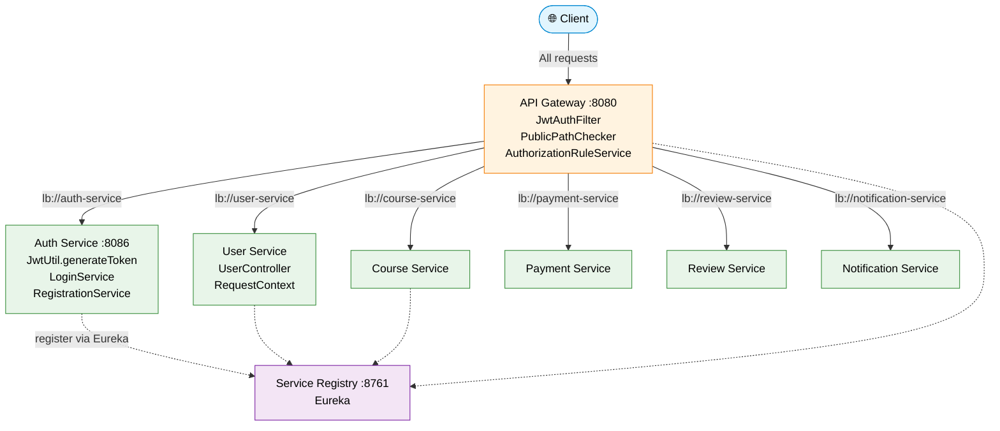
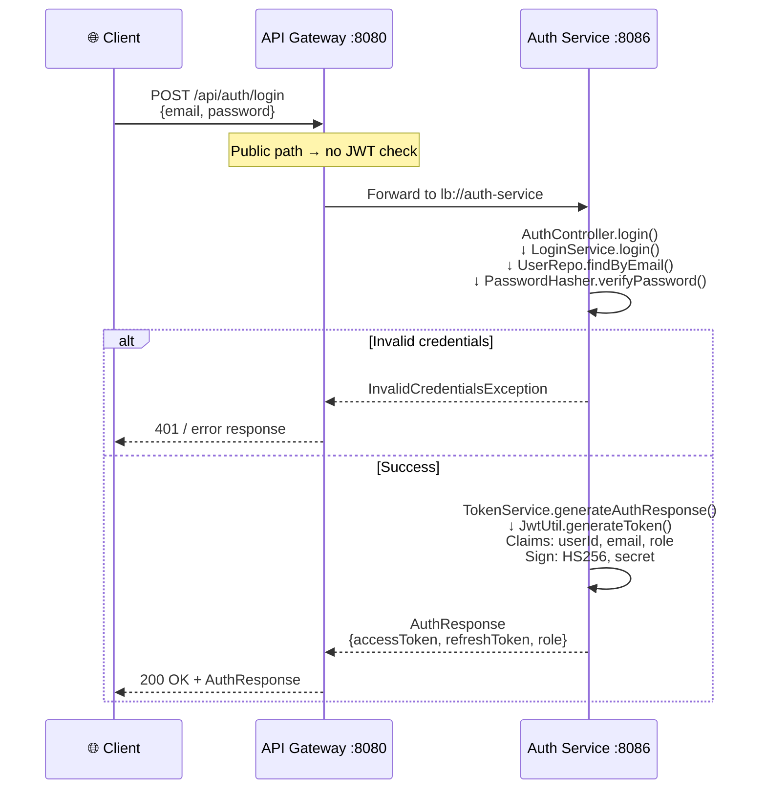
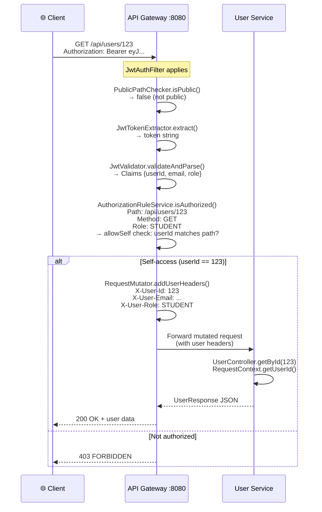

# LMS Platform — Security Architecture Deep Dive

> Internal team presentation — based on actual codebase (not theory)

---

## 1. System Overview

### Services

| Service | Port | Responsibility |
|---------|------|----------------|
| **API Gateway** (Spring Cloud Gateway) | `8080` | Single entry point, JWT validation, route forwarding, RBAC enforcement |
| **Auth Service** (Spring Boot) | `8086` | User registration, login, JWT generation, role assignment |
| **User Service** (Spring Boot) | — | User CRUD, profile updates, instructor approval |
| **Course / Payment / Notification / Review** | — | Domain-specific business logic (protected by Gateway) |
| **Service Registry** (Eureka) | `8761` | Service discovery (`lb://` routing) |

### Key Principle
> **JWT is validated ONLY at the Gateway.** Downstream services trust the headers added by the Gateway and never validate JWT themselves.

---

## 2. Authentication Flow (Login)

### Endpoint
`POST /api/auth/login` → `AuthController.login()` (`auth-service`)

### Step-by-Step

1. Client sends `POST /api/auth/login` with `LoginRequest` body (`email`, `password`)
2. `AuthController.login()` calls `AuthService.login()` → `LoginService.login()`
3. `LoginService` fetches user via `UserRepo.findByEmail()`
4. Password verified via `PasswordHasher.verifyPassword()` (peppered + salted hash)
5. On success, `TokenService.generateAuthResponse(user)` is called
6. `JwtUtil.generateToken(User user)` creates the JWT

### JWT Generation (`JwtUtil.generateToken`)

```java
Jwts.builder()
    .setSubject(String.valueOf(user.getId()))       // subject = userId
    .claim("userId", String.valueOf(user.getId()))
    .claim("email", user.getEmail())
    .claim("role", user.getRole().getName())         // e.g. "ADMIN", "INSTRUCTOR", "STUDENT"
    .setIssuedAt(new Date())
    .setExpiration(new Date(System.currentTimeMillis() + JwtProperties.getExpiration()))
    .signWith(JwtProperties.signingKey(), SignatureAlgorithm.HS256)
    .compact();
```

- **Secret**: `supersecretkey-supersecretkey-2026` (configured via `jwt.secret`)
- **Expiration**: `3600000ms` (1 hour) by default, configurable via `JWT_EXPIRATION_MS`
- **Algorithm**: HS256

### Response (`AuthResponse`)
```json
{
  "accessToken": "eyJ...",
  "refreshToken": "eyJ...",
  "role": "STUDENT",
  "email": "user@example.com"
}
```

---

## 3. Gateway Filter Deep Dive (CRITICAL)

### Filter Class
`com.lms.api_gateway.filter.JwtAuthFilter` extends `AbstractGatewayFilterFactory`

Applied to routes via:
```properties
spring.cloud.gateway.routes[N].filters[0]=JwtAuthFilter
```

### Dependencies (injected in constructor)

| Class | Role |
|-------|------|
| `JwtTokenExtractor` | Extract Bearer token from `Authorization` header |
| `JwtValidator` | Validate signature + expiration, parse claims |
| `PublicPathChecker` | Decide if a path is publicly accessible |
| `AuthorizationRuleService` | Enforce role-based access rules |
| `RequestMutator` | Add user identity headers to downstream request |

### Full Lifecycle (inside `apply()` method)

```
Client Request
     │
     ▼
┌─────────────────────────────────┐
│  PublicPathChecker.isPublic()   │
│  Checks:                        │
│  - /api/auth/** (configured)    │
│  - /api/payments/webhook        │
│  - GET /api/courses/**          │
└─────────────────────────────────┘
     │
   public? ──YES──▶ chain.filter() (no JWT check)
     │
    NO
     │
     ▼
┌─────────────────────────────────┐
│  JwtTokenExtractor.extract()    │
│  - Reads Authorization header   │
│  - Strips "bearer " prefix      │
│  - Returns null if missing      │
└─────────────────────────────────┘
     │
  token null? ──YES──▶ 401 UNAUTHORIZED ◀── return
     │
     ▼
┌─────────────────────────────────┐
│  JwtValidator.validateAndParse()│
│  - Jwts.parser()                │
│    .setSigningKey(secretBytes)  │
│    .build()                     │
│    .parseClaimsJws(token)       │
│  - Throws ExpiredJwtException   │
│    if expired                   │
│  - Throws JwtException if       │
│    signature invalid            │
└─────────────────────────────────┘
     │
  exception? ──YES──▶ ExpiredJwtException → 401
                        JwtException → 403
     │
     ▼
┌─────────────────────────────────┐
│  Extract Claims:                │
│  - userId = getClaim("userId")  │
│    (falls back to subject)       │
│  - email  = getClaim("email")   │
│  - role   = getClaim("role")     │
└─────────────────────────────────┘
     │
     ▼
┌─────────────────────────────────┐
│  AuthorizationRuleService       │
│  .isAuthorized(path, method,    │
│                  userId, role)  │
└─────────────────────────────────┘
     │
 not authorized? ──YES──▶ 403 FORBIDDEN ◀── return
     │
     ▼
┌─────────────────────────────────┐
│  RequestMutator                 │
│  .addUserHeaders()              │
│  Adds headers:                  │
│  - X-User-Id: <userId>         │
│  - X-User-Email: <email>        │
│  - X-User-Role: <role>          │
└─────────────────────────────────┘
     │
     ▼
 chain.filter() ──▶ Forwarded to downstream service
```

### Error Responses in Code (`JwtAuthFilter.java`)

| Condition | HTTP Status | Code Location |
|-----------|-------------|---------------|
| No token / null token | `401` | Lines 52-54 |
| `ExpiredJwtException` | `401` | Lines 70-72 |
| `JwtException` (bad sig) | `403` | Lines 73-75 |
| Not authorized (role) | `403` | Lines 63-64 |

---

## 4. Authorization Rules

### `AuthorizationRuleService` — Access Rules

Defined in `AuthorizationRuleService.java`:

```java
private final List<AccessRule> rules = List.of(
    rule(GET,    "/api/users",                        ADMIN),
    rule(GET,    "^/api/users/email/[^/]+$",          ADMIN),
    rule(PUT,    "^/api/users/([^/]+)/approve-instructor$", ADMIN),
    rule(GET,    "^/api/users/([^/]+)$",              ADMIN, allowSelf=true),
    rule(PUT,    "^/api/users/([^/]+)$",              ADMIN, allowSelf=true)
);
```

### Rule Logic

- If **no rule matches** the path+method → request is **allowed** (returns `true`)
- If a rule matches:
  - Check if user's role is in `allowedRoles` → allow
  - If `allowSelf=true`, check if `userId` matches the path ID (regex group 1) → allow
  - Otherwise → `403 FORBIDDEN`

### Public Paths (No JWT Required)

Configured in `application.properties`:
```properties
jwt.public-paths=/api/auth/**,/api/payments/webhook
```

Plus hardcoded in `PublicPathChecker.java`:
```java
return path.startsWith("/api/courses") && HttpMethod.GET.equals(method);
```

So public paths are:
- `POST /api/auth/register`
- `POST /api/auth/login`
- `POST /api/auth/refresh`
- `GET /api/auth/validate`
- `PUT /api/auth/users/{userId}/role`
- `DELETE /api/auth/users/{userId}`
- `POST /api/payments/webhook`
- `GET /api/courses/**` (public browsing)

---

## 5. Request Flow (Secured Endpoint)

### Example: `GET /api/users/123`

```
[Client]
   │  GET /api/users/123
   │  Authorization: Bearer eyJ...
   ▼
[API Gateway :8080]
   │
   ├─ Path matches route: lb://user-service
   ├─ JwtAuthFilter applies
   ├─ PublicPathChecker.isPublic() → false
   ├─ JwtTokenExtractor.extract() → "eyJ..."
   ├─ JwtValidator.validateAndParse()
   │    └─ Signature valid, not expired
   ├─ Extract claims: userId=456, email=..., role=ADMIN
   ├─ AuthorizationRuleService.isAuthorized()
   │    └─ Path: /api/users/123, Method: GET
   │    └─ Matches rule: GET ^/api/users/([^/]+)$, ADMIN, allowSelf=true
   │    └─ Role=ADMIN → authorized ✓
   ├─ RequestMutator.addUserHeaders()
   │    └─ X-User-Id: 456
   │    └─ X-User-Email: admin@example.com
   │    └─ X-User-Role: ADMIN
   │
   ▼  (mutated request with headers)
[User Service]
   │
   ├─ UserController.getById(123)
   ├─ RequestContext.getUserId(request) → "456"
   ├─ Service returns user data
   │
   ▼
[Client] ← JSON response
```

### How User Service Reads Identity

`com.lms.user.util.RequestContext`:
```java
public String getUserId(HttpServletRequest request) {
    return request.getHeader("X-User-Id");
}
public String getUserRole(HttpServletRequest request) {
    return request.getHeader("X-User-Role");
}
```

---

## 6. Error Handling

### Where Errors Are Returned

All error responses are sent **from the Gateway**, not downstream services.

| Scenario | Status | Thrown At |
|----------|--------|-----------|
| No `Authorization` header | `401` | `JwtAuthFilter.java:52` |
| Token is null / not Bearer | `401` | `JwtAuthFilter.java:52` |
| Token expired | `401` | `JwtAuthFilter.java:71` (`ExpiredJwtException`) |
| Invalid signature / malformed | `403` | `JwtAuthFilter.java:74` (`JwtException`) |
| Role not authorized | `403` | `JwtAuthFilter.java:63` |
| User tries to access another user's resource | `403` | `JwtAuthFilter.java:63` |

### Auth Service Own Validation (for `/validate` endpoint only)

`JwtUtil.validateAndExtract()` in auth-service:
```java
try {
    return Jwts.parser().setSigningKey(...).build().parseClaimsJws(token).getBody();
} catch (ExpiredJwtException e) { throw new TokenExpiredException(); }
  catch (JwtException e)        { throw new InvalidTokenException(); }
```

---

## 7. Security Design Decisions

### Why Validate JWT Only in Gateway?

1. **Single responsibility**: Gateway is the single entry point; all external traffic passes through it
2. **Downstream simplicity**: Services don't need JWT dependencies or secret keys
3. **Centralized auth logic**: Auth rules live in one place (`AuthorizationRuleService`)
4. **Performance**: No redundant validation at each service

### Why Services Trust Gateway Headers?

- Services receive `X-User-Id`, `X-User-Email`, `X-User-Role` headers added by `RequestMutator`
- These headers are set **after** JWT validation passes
- Services use `RequestContext` to read these headers
- Assumption: **No external traffic can bypass the Gateway** (in production, direct service ports should be network-restricted)

### Assumptions Made

- `jwt.secret` is the same in `auth-service` and `api-gateway` (must be kept in sync)
- `AuthorizationRuleService` rules are hardcoded — changing them requires redeployment
- User Service assumes `X-User-Id` header is always present for requests that reach it
- Role names in JWT claims match role names in `AuthorizationRuleService` (e.g., `"ADMIN"`)

---

## 8. Demo Plan — Postman Testing

### Step 1: Register a New User

```
POST http://localhost:8080/api/auth/register
Content-Type: application/json

{
  "email": "student@test.com",
  "password": "password123",
  "fullName": "Test Student"
}
```

→ Returns `AuthResponse` with `accessToken`

---

### Step 2: Login

```
POST http://localhost:8080/api/auth/login
Content-Type: application/json

{
  "email": "student@test.com",
  "password": "password123"
}
```

→ Returns:
```json
{
  "accessToken": "eyJhbGciOiJIUzI1NiJ9...",
  "refreshToken": "eyJ...",
  "role": "STUDENT",
  "email": "student@test.com"
}
```

---

### Step 3: Access a Secured Endpoint (Self)

```
GET http://localhost:8080/api/users/{userId}
Authorization: Bearer <accessToken>
```

→ Should return `200 OK` with user data (self-access allowed by `allowSelf=true`)

---

### Step 4: Try to Access Admin-Only Endpoint

```
GET http://localhost:8080/api/users
Authorization: Bearer <studentToken>
```

→ Should return `403 FORBIDDEN` (STUDENT role not in allowed roles)

---

### Step 5: Access Without Token

```
GET http://localhost:8080/api/users/1
(no Authorization header)
```

→ Should return `401 UNAUTHORIZED`

---

### Step 6: Public Path (No Token Needed)

```
GET http://localhost:8080/api/courses
(no Authorization header)
```

→ Should return `200 OK` (public GET browsing)

---

## 9. Common Mistakes & Observations

### Potential Weaknesses

| Issue | Location | Notes |
|-------|----------|-------|
| **Shared secret must match** | `jwt.secret` in both `auth-service` and `api-gateway` | If out of sync, all tokens become invalid |
| **Hardcoded role rules** | `AuthorizationRuleService` | Rules require redeployment to change |
| **Public path pattern matching** | `PublicPathChecker` | Uses `startsWith` after stripping `/**` — ensure no overlap issues |
| **JWT secret in properties** | `application.properties` | Should use env vars / secrets manager in production (currently `JWT_SECRET` env var is supported) |
| **No HTTPS mentioned** | Gateway config | Tokens sent over HTTP are interceptable — HTTPS is essential in production |
| **User Service assumes headers** | `RequestContext` | No null-check if Gateway is bypassed (network security needed) |
| **`getUserRole()` returns String** | `RequestContext` | Case-sensitive comparison (`"ADMIN".equals()`) — consistent casing required |
| **403 vs 401 semantics** | `JwtAuthFilter:74` | General `JwtException` returns 403, but could be 401 (e.g., malformed token) |

### Good Practices Observed

- Refresh token support via `POST /api/auth/refresh`
- Password peppered + salted (`PasswordHasher`, `PASSWORD_PEPPER` env var)
- Eureka service discovery (`lb://` routing)
- CORS configured globally on Gateway
- `@Valid` request DTO validation in `AuthController`
- Logging via `@Slf4j` in services (`AuthServiceImpl`, `LoginService`)

---

## Mermaid Diagrams

### 1. High-Level Architecture



---

### 2. Authentication Flow (Login)



---

### 3. Gateway Filter Decision Flow

```mermaid
flowchart TD
    style Start fill:#e1f5fe,stroke:#0288d1,color:#000
    style Public fill:#e8f5e9,stroke:#388e3c,color:#000
    style Extract fill:#fff3e0,stroke:#f57c00,color:#000
    style Validate fill:#fff3e0,stroke:#f57c00,color:#000
    style Claims fill:#fff3e0,stroke:#f57c00,color:#000
    style Authz fill:#fce4ec,stroke:#c62828,color:#000
    style Mutate fill:#f3e5f5,stroke:#7b1fa2,color:#000
    style Forward fill:#e8f5e9,stroke:#388e3c,color:#000
    style Unauth fill:#ffcdd2,stroke:#c62828,color:#000
    style Forbidden fill:#ffcdd2,stroke:#c62828,color:#000

    Start([Client Request]) --> Public{PublicPathChecker<br/>.isPublic(path, method)?}

    Public -->|Yes| ForwardNoAuth[Allow through<br/>no JWT check] --> Forward

    Public -->|No| Extract[JwtTokenExtractor<br/>.extract(request)]
    Extract -->|Token null?| Unauth401[401 UNAUTHORIZED]:::Unauth
    Extract -->|Token found| Validate[JwtValidator<br/>.validateAndParse(token)]
    Validate -->|ExpiredJwtException| Unauth401
    Validate -->|JwtException| Forbidden403[403 FORBIDDEN]:::Forbidden
    Validate -->|Valid| Claims[Extract Claims<br/>userId, email, role<br/>via jwtValidator.getClaim()]
    Claims --> Authz{AuthorizationRuleService<br/>.isAuthorized(path, method,<br/>userId, role)?}
    Authz -->|No| Forbidden403
    Authz -->|Yes| Mutate[RequestMutator<br/>.addUserHeaders()<br/>X-User-Id, X-User-Email,<br/>X-User-Role]
    Mutate --> Forward[Forward to downstream<br/>service via lb://]
```

---

### 4. Secured Request Flow



---

## Quick Reference — Key Classes

| Class | Module | Purpose |
|-------|--------|---------|
| `JwtAuthFilter` | api-gateway | Main gateway filter, orchestrates auth flow |
| `JwtTokenExtractor` | api-gateway | Extracts Bearer token from header |
| `JwtValidator` | api-gateway | Validates JWT signature and expiration |
| `PublicPathChecker` | api-gateway | Determines if path is publicly accessible |
| `AuthorizationRuleService` | api-gateway | Enforces role-based access control |
| `RequestMutator` | api-gateway | Adds user identity headers to downstream requests |
| `JwtUtil` | auth-service | Generates JWT (`generateToken`) and validates (`validateAndExtract`) |
| `JwtProperties` | auth-service | Holds `secret`, `expiration`, `refreshExpiration` config |
| `AuthController` | auth-service | Exposes `/api/auth/**` endpoints |
| `LoginService` | auth-service | Handles login logic + password verification |
| `RequestContext` | user-service | Reads `X-User-*` headers from incoming requests |
| `UserController` | user-service | User CRUD endpoints (protected by Gateway) |
